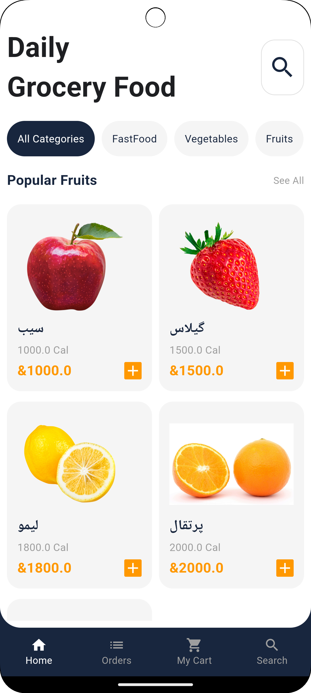
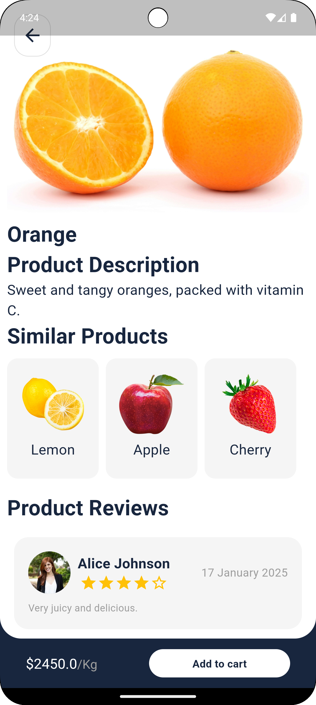

# Gronur - فروشگاه آنلاین

این پروژه یک اپلیکیشن فروشگاهی آنلاین است که امکان خرید و جستجوی محصولات مختلف مانند میوه‌ها و سبزیجات را فراهم می‌کند. این اپلیکیشن شامل صفحات ورود و ثبت‌نام، نمایش محصولات، جزئیات سفارش و پیگیری وضعیت سفارش‌ها است.

## امکانات

- **صفحه اسپلش**: صفحه خوش‌آمدگویی با لوگوی اپلیکیشن.
- **صفحه ورود و ثبت‌نام**: کاربران می‌توانند وارد اپلیکیشن شوند یا حساب جدید بسازند.
- **جستجوی محصولات**: امکان جستجو و فیلتر محصولات مختلف.
- **جزئیات محصول**: نمایش جزئیات هر محصول شامل قیمت و نظرات کاربران.
- **سبد خرید**: اضافه کردن محصولات به سبد خرید و مدیریت آن.
- **پیگیری سفارش‌ها**: نمایش وضعیت سفارش و پیگیری آن تا تحویل.
- **پرداخت آنلاین**: امکان پرداخت با استفاده از کارت‌های اعتباری مختلف.

## نسخه فلاتر

این پروژه با نسخه فلاتر 3.27.1 ساخته شده است.

## اسکرین‌شات‌ها

## نحوه استفاده

1. کد را کلون کرده و به پوشه پروژه بروید.
2. برای نصب وابستگی‌ها از دستور `flutter pub get` استفاده کنید.
3. برای اجرای اپلیکیشن از دستور `flutter run` استفاده کنید.

## ارتباط با من

- ایمیل: masoodyarab2@gmail.com
- گیت‌هاب: [https://github.com/masoodhh](https://github.com/masoodhh)

---

# Gronur - Online Store

This is an online grocery store app that allows users to browse and purchase various products such as fruits and vegetables. The app includes login and registration pages, product listings, order details, and order tracking.

## Features

- **Splash Screen**: A welcoming screen with the app logo.
- **Login and Register Page**: Users can log in or create a new account.
- **Product Search**: Search and filter through different products.
- **Product Details**: Displaying product details including price and user reviews.
- **Shopping Cart**: Adding and managing products in the cart.
- **Order Tracking**: Displaying the status of the order and tracking it until delivery.
- **Online Payment**: Payment using various credit cards.

## Flutter Version

This project is built with Flutter version 3.27.1.

## Screenshots

## How to Use

1. Clone the code and navigate to the project folder.
2. Use `flutter pub get` to install dependencies.
3. Run the app using the command `flutter run`.

## Contact

- Email: masoodyarab2@gmail.com
- GitHub: [https://github.com/masoodhh](https://github.com/masoodhh)

